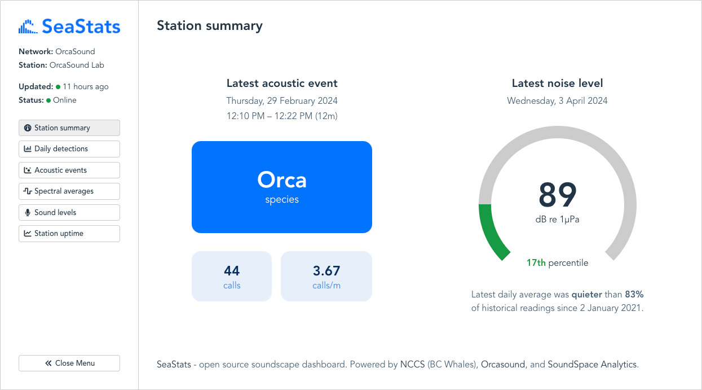
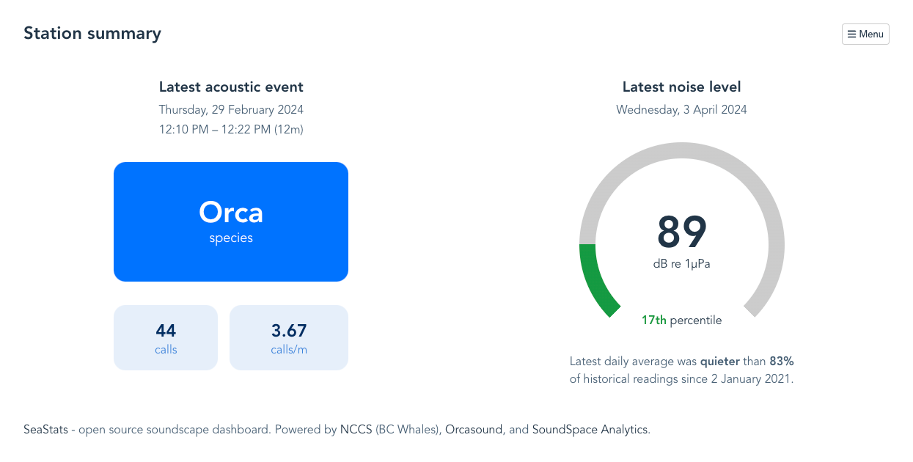

# SeaStats bioacoustic dashboard client



## Overview

SeaStats is an embeddable interactive dashboard for visualising bioacoustic data. This project has initially been developed with a focus on whale detections (via hydrophone audio recordings), but has been designed with the intention of it being adaptable for other uses.

This repo contains the front-end dashboard web application. It requests data from a REST API, for which a specification is provided below. A [CloudFlare Workers implementation](https://github.com/orcasound/seastats-api-cloudflare-workers) of the API is available.

The dashboard is designed to present bioacoustic data for a single hydrophone station at a time. Charts include filters for date range, signal type, and other options.

The API is designed to support multiple stations across one or more organizations, and the logo and other options can be customised for each organization.

[See a demo here](https://seastats.whalesound.ca/olab/fibs-01).

## Acknowledgements

This project is funded by [NCCS](https://bcwhales.org/) (BC Whales) and [Orcasound](https://www.orcasound.net/), and developed by [Soundspace Analytics](https://soundspaceanalytics.ca/).

## Technical stack

- [**React.js**](https://reactjs.org/) for the front-end UI and rendering framework. This is a mature product that is widely used by developers. It is the leading 'reactive' framework.
- [**Plotly**](https://plotly.com/javascript/react/) for charting. This library is very capable and popular, and is offered in a number of different programming languages, including Python. This makes it a good choice for an open source project as contributors who aren't familiar with Javascript may nonetheless have experience with Plotly and be able to work on this layer as the APIs are very similar across different languages.
- [**Vite**](https://vitejs.dev/guide/) for building and local development.

## Available components

### Summary chart

Intended as 'home page' for the dashboard. Shows details of latest acoustic event and noise levels for station.



### Acoustic events chart

A scatter chart displaying compiled acoustic activity events. User can select which signal type they want to display and enable sunrise/sunset times and lunar phase overlays.


### Daily detections chart

A bar chart displaying call detection rates for 24h periods. User can select which signal type they want to display and enable smoothing options.


### Recording consistency chart

A bar chart displaying recording consistency (station uptime). Includes smoothing options.


### Sound level chart

A line chart displaying noise levels and noise exceedance percentiles. User can select metric type and frequency band to display.


### Static graphic chart

A static image is shown for a selected date. User can select a date to view (limited to available data), and navigate with prev/next buttons.


### User settings

The values that can be selected in component settings (such as call type and frequency bands) are dynamically produced based on the data returned from the API.

## API specification

The SeaStats dashboard interacts with a REST API to retrieve data for display. A CloudFlare Workers implementation of the API is available [here](https://github.com/orcasound/seastats-api-cloudflare).

The API is designed to support multiple stations across one or more organizations. Organizations may be password (aka 'API key') protected, in which case only limited summary information and metadata about the organization is accessible without supplying a password.

### API endpoints

All endpoints should return a JSON object with a `data` key containing the requested data, along with a `success` key with a boolean value indicating whether the request was successful. If the request was not successful, a `msg` key should be included with a message explaining the error.

| Key     | Type    | Description                                       |
| ------- | ------- | ------------------------------------------------- |
| success | boolean | Indicates whether the request was successful.     |
| msg     | string  | A message explaining the result of the operation. |
| data    | object  | An object containing the requested data.          |

#### GET `organization/{ORGANIZATION_KEY}`

| Key     | Type    | Description                                    |
| ------- | ------- | ---------------------------------------------- |
| key     | string  | The key of the organization.                   |
| name    | string  | The name of the organization.                  |
| logoUrl | string  | The URL of the organization's logo. (optional) |
| public  | boolean | Indicates whether the organization is public.  |

Example result for `GET {API_URL}/organization/olab`:

```json
{
  "success": true,
  "msg": "Operation was successful",
  "data": {
    "key": "olab",
    "name": "OrcaLab",
    "logoUrl": "https://placehold.co/300x200.png",
    "public": true
  }
}
```

#### GET `station/{ORGANIZATION_KEY}/{STATION_KEY}`

`data` result object structure:

| Key             | Type    | Description                                                                                                                   |
| --------------- | ------- | ----------------------------------------------------------------------------------------------------------------------------- |
| stationKey      | string  | The key of the station.                                                                                                       |
| organizationKey | string  | The key of the organization.                                                                                                  |
| name            | string  | The name of the station.                                                                                                      |
| latitude        | number  | The latitude of the station.                                                                                                  |
| longitude       | number  | The longitude of the station.                                                                                                 |
| timeZone        | string  | The time zone of the station ([IANA time zone canonical name](https://en.wikipedia.org/wiki/List_of_tz_database_time_zones)). |
| logoUrl         | string  | The URL of the station's logo. (optional)                                                                                     |
| updated         | string  | The last updated date and time of the station.                                                                                |
| online          | boolean | Indicates whether the station is online.                                                                                      |
| dataSummary     | array   | An array describing the types and ranges of data available for this station.                                                  |
| uploadSummary   | array   | An array describing the uploads available for this station.                                                                   |
| sidebarText     | array   | An array of label/text pairs to be displayed in the UI sidebar. (optional)                                                    |

`dataSummary` object structure:

| Key           | Type   | Description                                             |
| ------------- | ------ | ------------------------------------------------------- |
| dataPointType | string | The type of the data point.                             |
| count         | number | The number of data points of this kind that are stored. |
| minDate       | string | The earliest date for this data point type.             |
| maxDate       | string | The latest date for this data point type.               |

`uploadSummary` object structure:

| Key        | Type   | Description                        |
| ---------- | ------ | ---------------------------------- |
| uploadType | string | The type of the upload.            |
| count      | number | The number of uploads of this type |

`sidebarText` object structure:

| Key   | Type   | Description                      |
| ----- | ------ | -------------------------------- |
| label | string | The label for the sidebar text.  |
| text  | string | The actual text for the sidebar. |

Example result for `GET {API_URL}/station/olab/fibs-01`:

```json
{
  "success": true,
  "msg": "Operation was successful",
  "data": {
    "stationKey": "fibs-01",
    "organizationKey": "olab",
    "name": "Flower Island",
    "latitude": 50.600408,
    "longitude": -126.70807,
    "timeZone": "America/Vancouver",
    "logoUrl": "https://placehold.co/300x200.png",
    "updated": "2024-03-02T00:48:22.161Z",
    "online": true,
    "sidebarText": [
      {
        "label": "Organization",
        "text": "OrcaLab"
      },
      {
        "label": "Site",
        "text": "Flower Island"
      },
      {
        "label": "Region",
        "text": "Northern Vancouver Island"
      }
    ],
    "dataSummary": [
      {
        "dataPointType": "callEvent",
        "count": 1072,
        "minDate": "2021-05-12",
        "maxDate": "2024-02-06"
      },
      {
        "dataPointType": "callRate",
        "count": 1566,
        "minDate": "2021-01-01",
        "maxDate": "2024-02-22"
      },
      {
        "dataPointType": "exceedance",
        "count": 33831,
        "minDate": "2021-01-01",
        "maxDate": "2024-02-22"
      },
      {
        "dataPointType": "noise",
        "count": 4106,
        "minDate": "2021-01-01",
        "maxDate": "2024-02-22"
      },
      {
        "dataPointType": "recordingCoverage",
        "count": 1148,
        "minDate": "2021-01-01",
        "maxDate": "2024-02-22"
      }
    ],
    "uploadSummary": [
      {
        "uploadType": "ltsa-1d",
        "count": 834
      },
      {
        "uploadType": "spd-1m",
        "count": 20
      }
    ]
  }
}
```

#### GET `station-uploads/{ORGANIZATION_KEY}/{STATION_KEY}`

Optional query parameters:

- `uploadType` (string): The type of upload to filter by.

`data` result is an array containing objects with this structure:

| Key      | Type   | Description                             |
| -------- | ------ | --------------------------------------- |
| key      | string | The key of the upload.                  |
| uploaded | string | The date and time the upload was added. |
| url      | string | The URL to access the upload.           |

Note: for the purpose of the [Static Graphic chart](#static-graphic-chart), the filename of uploads should be in the format `YYYY-MM-DD.png`, to allow a date-based navigation to be built.

Example result for `GET {API_URL}/station-uploads/olab/fibs-01`:

```json
{
  "success": true,
  "msg": "Operation was successful",
  "data": [
    {
      "key": "olab/fibs-01/ltsa-1d/2021-04-05.png",
      "uploaded": "2024-02-29T23:49:15.747Z",
      "url": "https://your-seatstats-api-url.dev/organization-upload/olab/fibs-01/ltsa-1d/2021-04-05.png"
    },
    {
      "key": "olab/fibs-01/ltsa-1d/2021-04-06.png",
      "uploaded": "2024-02-29T23:49:15.979Z",
      "url": "https://your-seatstats-api-url.dev/organization-upload/olab/fibs-01/ltsa-1d/2021-04-06.png"
    },
    {
      "key": "olab/fibs-01/ltsa-1d/2021-04-07.png",
      "uploaded": "2024-02-29T23:49:16.717Z",
      "url": "https://your-seatstats-api-url.dev/organization-upload/olab/fibs-01/ltsa-1d/2021-04-07.png"
    }
  ]
}
```

#### GET `data/{ORGANIZATION_KEY}/{STATION_KEY}`

Optional query parameters:

- dataPointType (string): The type of data point to filter by.
- fromDate (string): The start date for the data range.
- toDate (string): The end date for the data range.
- band (string): The frequency band to filter by.
- threshold (string) : The threshold to filter by.
- species (string): The species to filter by.
- callType (string): The call type to filter by.

`data` result is an array of objects with the following properties. Only the `dataPointType` property is always present, the rest depend on the type of data point being returned.

| Key           | Type           | Description                                |
| ------------- | -------------- | ------------------------------------------ |
| dataPointType | string         | The type of the data point.                |
| value         | number or null | The value of the data point.               |
| date          | string         | The date and time of the data point.       |
| startDateTime | string         | The start date and time of the data point. |
| endDateTime   | string         | The end date and time of the data point.   |
| band          | string         | The frequency band of the data point.      |
| threshold     | string         | The threshold of the data point.           |
| species       | string         | The species of the data point.             |
| callType      | string         | The call type of the data point.           |
| callCount     | number         | The number of calls in the data point.     |

Example result for `GET {API_URL}/data/olab/fibs-01?fromDate=2021-01-03&toDate=2021-01-03`:

```json
{
  "success": true,
  "msg": "Operation was successful",
  "data": [
    {
      "dataPointType": "callRate",
      "species": "Orca",
      "callType": "Social",
      "date": "2021-01-03",
      "value": 0
    },
    {
      "dataPointType": "callEvent",
      "species": "Humpback",
      "callType": "Social",
      "startDateTime": "2021-01-03T21:39:46.450Z",
      "endDateTime": "2021-01-03T21:44:53.900Z",
      "callCount": 20
    },
    {
      "dataPointType": "recordingCoverage",
      "date": "2021-01-03",
      "value": 0.16527777777777777
    },
    {
      "dataPointType": "noise",
      "band": "10-100 Hz",
      "date": "2021-01-03",
      "value": 101.4493593
    },
    {
      "dataPointType": "noise",
      "band": "100-1000 Hz",
      "date": "2021-01-03",
      "value": 98.43086986
    },
    {
      "dataPointType": "exceedance",
      "band": "10-100 Hz",
      "threshold": "90 dB",
      "date": "2021-01-03",
      "value": 0.98828125
    },
    {
      "dataPointType": "exceedance",
      "band": "10-100 Hz",
      "threshold": "100 dB",
      "date": "2021-01-03",
      "value": 0.7142857142857143
    },
    {
      "dataPointType": "exceedance",
      "band": "100-1000 Hz",
      "threshold": "90 dB",
      "date": "2021-01-03",
      "value": 0.0101237345331
    },
    {
      "dataPointType": "exceedance",
      "band": "100-1000 Hz",
      "threshold": "100 dB",
      "date": "2021-01-03",
      "value": 0.58605174353
    }
  ]
}
```

## Local development

### Initial setup

0. (pre-requisite) Install [Node.js](https://nodejs.org/en/) on your system
1. Open the project directory root in a terminal window.
2. Run `npm install` to install the project dependencies.
3. Create a `.env` or `.env.local` file in the project root with the `VITE_API_URL` variable set to the URL of the API server.

### Running the application

1. Open the project directory root in a terminal window.
2. Run `npm run dev` to start the development server which allows you to interact with the app and see code changes reflected in real time.

### Building the application

1. Ensure you have a `.env` or `.env.production` file in the project root with the `VITE_API_URL` variable set to the URL of the API server.
2. Open the project directory root in a terminal window.
3. Run `npm run build`
4. (optional) Run `npm run preview` to view the application via a local server.

Note: you can optionally also have a `.env.staging` file and run `npm run build -- --mode staging` to build the application for a staging environment.

## Hosting

After building the application, the contents of the `dist` directory can be hosted on a web server. The web app uses client-side routing, so the server must be configured to serve the `index.html` file for all routes. Many static site hosts (e.g. Netlify, Vercel, GitHub Pages) will handle this automatically, or by enabling a 'single page app' setting.

Note that by default, visiting the root path of the hosted site will display an error message. To know which organisation and station to display the dashboard for, the URL must include the organisation and station keys in the path. For example, to view the dashboard for the OrcaLab Flower Island station, the URL would be `https://your-hosted-site.com/olab/fibs-01`. An alternative to including the keys in the path is to include them in configuration passed to the `mount()` function (see the [Customisation options](#customisation-options) section).

## Embedding

The application can be embedded in an existing website easily by using an iframe, or you can render the application directly in to the DOM of another web page by loading the assets found in the dist folder, and then mounting the application with custom configuration. See the [Customisation options](#customisation-options) section for more information.

To see examples of embedding the application and switching between stations, [run the application](#running-the-application) and visit the `/embed-demo.html` route.

## Customisation options

## The configuration object

The application can be customised by passing a configuration object to the `mount()` function. You can create a config object with the default values by calling `seaStats.options()` and then override the properties you want to change. You can see the [default values here](src/utils/mountOptions.js). The following properties are available:

| Option          | Type   | Description                                                                                                              |
| --------------- | ------ | ------------------------------------------------------------------------------------------------------------------------ |
| organizationKey | string | The key of the organization.                                                                                             |
| stationKey      | string | The key of the station.                                                                                                  |
| styles          | string | The CSS styling to be applied. May be 'all' or 'minimal'.                                                                |
| chartColors     | array  | An array of CSS-compatible color values to be used in the charts.                                                        |
| creditsHtml     | string | HTML string for the credits section.                                                                                     |
| charts          | array  | An array of chart objects, describing which charts should be included in the dashboard and how they should be configured |

Each chart object in the `charts` array has the following structure:

| Key             | Type   | Description                                                                                                                               |
| --------------- | ------ | ----------------------------------------------------------------------------------------------------------------------------------------- |
| title           | string | The display title of the chart.                                                                                                           |
| component       | string | The component to be used for the chart, which is the filename minus the extension. Browse the [charts directory](src/charts) for options. |
| descriptionHtml | string | HTML string for the description of the chart, which is shown in an overlay. (Not applicable to the Summary Chart.)                        |
| uploadType      | string | The type of upload for the chart. (Applicable to the Static Graphic chart only.)                                                          |

Example of changing the default colors and defining which station to display:

```js
const config = new window.seaStats.options();

config.organizationKey = "olab";
config.stationKey = "fibs-01";
config.chartColors = ["rgba(255, 000, 100)", "teal", "#0000ff"];

window.seaStats.mount(config);
```

## Changing the logo

The [organization](#get-organizationorganization_key) and [station](#get-stationorganization_keystation_key) API endpoints can optionally return a `logoUrl` property in their result. If this is provided, the specified logo will be displayed in place of the SeaStats logo. The station logo will take precedence over the organization logo.

## Changing the sidebar text

The [station](#get-stationorganization_keystation_key) API endpoint can optionally return a `sidebarText` property in its result. This should be an array of objects, each containing a `label` and `text` property. These will be displayed in the sidebar of the dashboard instead of the default text (organization and station name).

## Changing the look and feel (overriding CSS)

The application will always load the `src/styles/layout.css` file, which contains the minimum styles required for the application to function. By default, the application will also load the `src/styles/theme.css` file, which contains additional styling. You can disable this by setting the `styles` property of the [configuration object](#the-configuration-object) to `minimal`.

Each CSS file defines a handful of CSS variables that you can override in your own CSS file. CSS class names used in the application are prefixed with `ss_` to avoid conflicts with other styles. You can override these styles by creating a CSS file with the same class names and variables, and including it in your project.

## Known issues

- Timezone support for the Acoustic Events chart is a work in progress:
  - We use the station's local timezone when displaying data, but Plotly only supports UTC time for x-axis labels. We attempted to use a date time value for the x value of acoustic events but this could give unexpected results when zooming in, and could cause the hover template date to be off by one day in some cases.
  - At time of writing, the SeaStats CloudFlare API doesn't correct for timezone when filtering data, so the Acoustic Events chart may show events that are outside the selected date range, or be missing some at the start or end of the selected date range. Additionally, acoustic events outside of the selected date range will show a 0% recording coverage for that day, which may be misleading.
